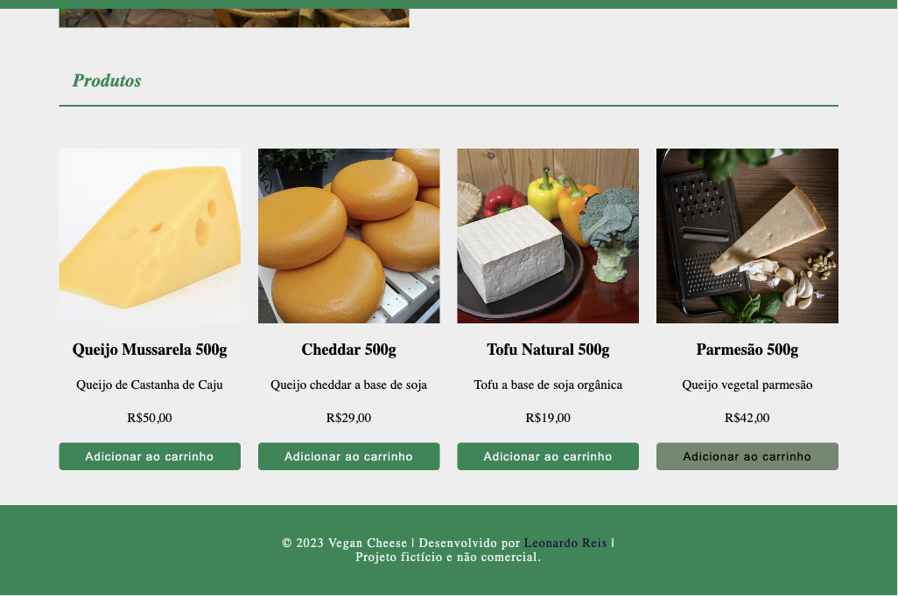
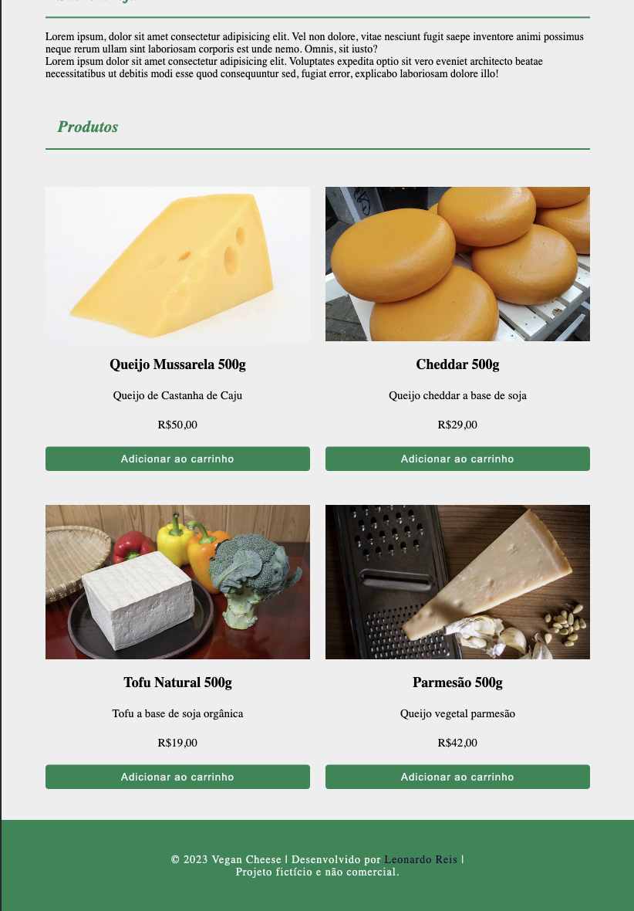
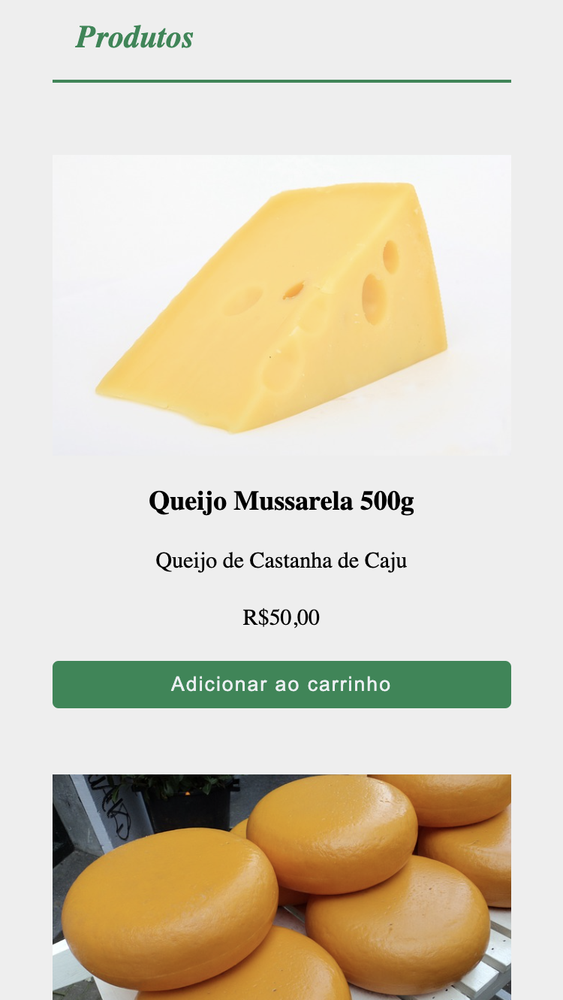

    
  

## ☕ Sobre o projeto

Este projeto tem como objetivo criar um layout responsivo para apresentar uma loja online fictícia especializada em queijos veganos.

## ⚙ Temas do projeto

- HTML semântico;
- Barra de navegação com links para seções da página;
- Utilização de medida responsiva (até 640 px, 641 a 1023px e maior que 1024px);
- Utilização do seletor root;
- Utilização de variáveis CSS
- Deploy;

## 🛠 Tecnologias Utilizadas

 </a>
 </a>

## 🎨 Layout

| Desktop                 | Tablet                | Mobile                |
| ----------------------------------------- | --------------------------------------- | --------------------------------------- |
|  |  |  |
| > 1024px                                  | 641 a 1023px                            | até 640 px                              |
